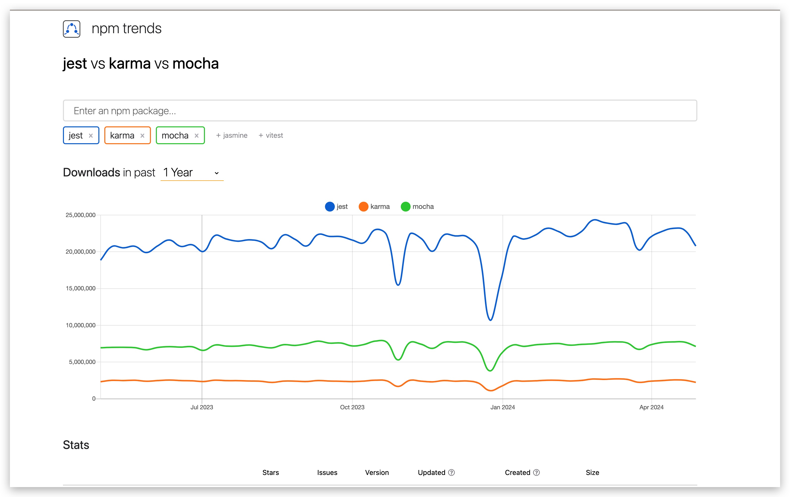
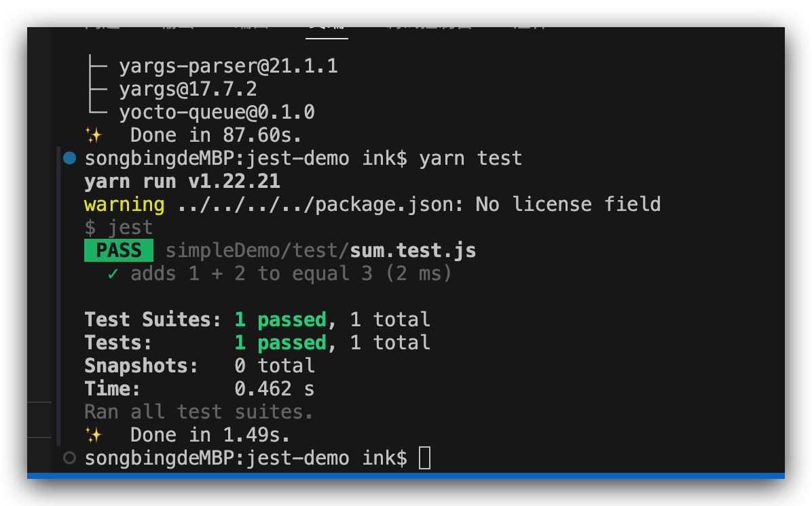
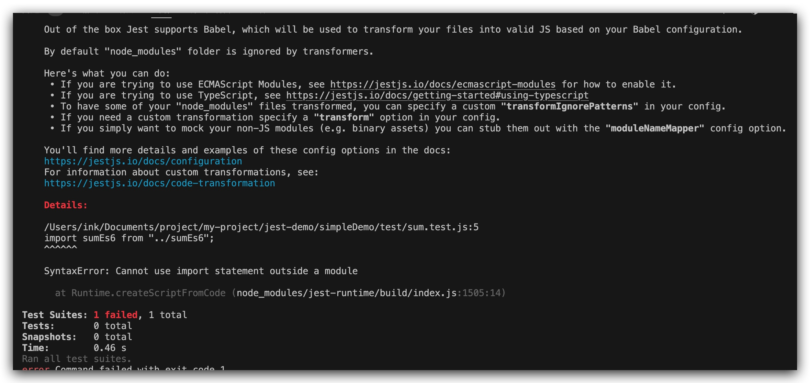

## 如何做前端单元测试

### 开篇

对于现在的前端工程，一个标准完整的项目，通常情况单元测试是非常必要的。但很多时候我们只是完成了项目而忽略了项目测试。我认为其中一个很大的原因是很多人对单元测试认知不够，因此写了这边文章，一方面期望通过这篇文章让你对单元测试有一个初步认识。另一个方面希望通过代码示例，让你掌握写单元测试实践能力

### 什么是前端单元测试

前端单元测试是指对前端代码中的<font color=#008000 >最小可测试单元</font>进行测试的过程。这些最小单元可以是函数、组件或模块等。通过编写针对这些单元的测试用例，我们可以验证它们在各种情况下的行为是否符合预期

### 前端为什么需要单元测试

- 提高代码质量：通过单元测试可以发现代码中的错误和缺陷，并确保代码的正确性和可靠性。
- 提高开发效率：单元测试可以帮助开发者更好地理解应用程序，并了解代码中的逻辑，从而更高效地开发和维护应用程序。
- 降低维护成本：单元测试可以帮助开发者快速定位和修复代码中的错误，从而降低维护成本。

### 常见的单元测试工具

- **Jest**：Jest 是 Facebook 开源的单元测试框架，具有快速、易于学习和使用等特点。
- **Mocha**：Mocha 是一个灵活且可扩展的 JavaScript 测试框架。
- **Karma**：Karma 是一个用于运行 JavaScript 测试的测试运行器。

##### 下载量

[三个工具 npm 下载量对比](https://npmtrends.com/jest-vs-karma-vs-mocha)



Jest 的下载量较大，一部分原因是因为 create-react-app 脚手架默认内置了 Jest, 而大部分 react 项目都是用它生成的。

##### 框架对比

| 框架  | 断言                     | 异步 | 代码覆盖率              |
| ----- | ------------------------ | ---- | ----------------------- |
| Mocha | 不支持（需要其他库支持） | 友好 | 不支持（需要其他库支持) |
| Jest  | 默认支持                 | 友好 | 默认支持                |

- Mocha 生态好，但是需要较多的配置来实现高扩展性 👍
- Jest 开箱即用 🚀️

**比如对 sum 函数写用例**, 我们举个例子 🌰

`./sum.js`

```
function sum(a, b) {
  return a + b;
}

module.exports = sum;
```

**Mocha + Chai 方式**
Mocha 需要引入 chai 或则其他断言库去断言, 如果你需要查看覆盖率报告你还需要安装 nyc 或者其他覆盖率工具

```
const { expect, assert } = require('chai');
const sum = require('./sum');

describe('sum', function() {
  it('adds 1 + 2 to equal 3', () => {
    assert(sum(1, 2) === 3);
  });
});
```

**jest 方式**

Jest 默认支持断言，同时默认支持覆盖率测试

```
const sum = require('./sum');

describe('sum function test', () => {
  it('sum(1, 2) === 3', () => {
    expect(sum(1, 2)).toBe(3);
  });


  test('sum(1, 2) === 3', () => {
    expect(sum(1, 2)).toBe(3);
  });
})
```

**可见无论是受欢迎度和写法上，Jest 都有很大的优势，因此推荐你使用开箱即用的 Jest**

### 如何开始

#### 1.安装依赖

```
npm install -D jest
or
yarn add jest -D
```

#### 2.简单的例子

首先，先初始化再创建一个 sum.js 文件

```
npm init
```

```
function sum(a, b) {
  return a + b;
}

module.exports = sum;
```

创建一个名为 sum.test.js 的文件，这个文件包含了实际测试内容：

`./test/sum.test.js`

```
const sum = require('../sum');

test('adds 1 + 2 to equal 3', () => {
  expect(sum(1, 2)).toBe(3);
});
```

将下面的配置部分添加到你的 package.json 里面

```
{
  "scripts": {
    "test": "jest"
  },
}
```

运行 npm run test 或者 yarn test ，jest 将打印下面这个消息



#### 3.不支持部分 ES6 语法

nodejs 采用的是 CommonJS 的模块化规范，使用 require 引入模块；而 import 是 ES6 的模块化规范关键字。想要使用 import，必须引入 babel 转义支持，通过 babel 进行编译，使其变成 node 的模块化代码
如以下文件改写成 ES6 写法后，运行 npm run test 或 yarn test 将会报错



解决办法
为了能使用这些新特性，我们就需要使用 babel 把 ES6 转成 ES5 语法

安装依赖

```
npm install --save-dev @babel/core @babel/preset-env
or
yarn add @babel/core @babel/preset-env -D
```

#### 4.测试 ts 文件

当我们的项目写组件或者插件时,用到 ts 时,我们也需要去测试他们的准确性.jest 需要借助 .babelrc 去解析 TypeScript 文件再进行测试

##### 安装依赖

```
npm install --save-dev @babel/preset-typescript
or
yarn add @babel/preset-typescript -D
```

**改写**.babelrc

#### 5.持续监听

#### 6.生成测试覆盖率报告

#### 7.如何编写单元测试

#### 8.常用断言方法
